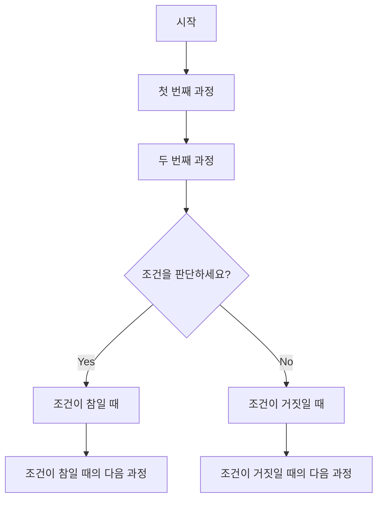

## 사용자 입력:
> markdown으로 데이터흐름도 같은 것을 만들 수 있나? 예제좀 보여줘.

## ChatGPT 응답:
> Markdown 자체는 주로 텍스트 포맷팅에 사용되며, 복잡한 다이어그램이나 데이터흐름도(DFD)를 직접 표현하기에는 제한적입니다. 하지만, 간단한 흐름도나 구조를 ASCII 아트나 일부 Markdown 확장을 통해 나타낼 수는 있습니다.

다음은 간단한 ASCII 아트로 표현한 데이터 흐름도 예제입니다:

```
+-----+       +-----+       +------+
|     |  -->  |     |  -->  |      |
| Src |       | Proc|       | Dest |
|     |       |     |       |      |
+-----+       +-----+       +------+
```

그러나 이 방법은 복잡한 다이어그램을 나타내기에는 적합하지 않습니다. 실제로 복잡한 흐름도나 다이어그램을 만들기 위해서는 전문적인 도구나 소프트웨어를 사용하는 것이 더 적합합니다.

다행히 GitHub과 같은 플랫폼에서는 Mermaid나 PlantUML과 같은 도구를 이용해서 Markdown 문서 안에서 복잡한 다이어그램을 그릴 수 있게 확장을 제공하기도 합니다. 이러한 확장을 이용하면 복잡한 다이어그램도 Markdown 내에서 그릴 수 있습니다. 하지만 이는 표준 Markdown에 포함되지 않은 확장 기능이므로 사용 가능한 환경에서만 동작합니다.

## 사용자 입력:
> mermaid기능이 추가되어 있어. 복잡한 예제 보여줘.

## ChatGPT 응답:
> Mermaid는 복잡한 다이어그램과 흐름도를 Markdown 안에서 생성할 수 있도록 해주는 도구입니다. 기본적인 구문을 사용하면 플로우 차트, 시퀀스 다이어그램, 클래스 다이어그램, 상태 다이어그램 등을 그릴 수 있습니다.

아래는 Mermaid를 사용한 간단한 플로우 차트 예제입니다:



위의 코드는 다음과 같은 흐름도를 생성합니다:

1. "시작"에서 시작하여 "첫 번째 과정"으로 이동합니다.
2. "두 번째 과정"으로 진행되며, 그 후 "조건을 판단하세요?"라는 결정 블록에 도달합니다.
3. 결정 블록에서 "Yes"의 경우 "조건이 참일 때"로, "No"의 경우 "조건이 거짓일 때"로 나뉩니다.
4. 각각의 경로에서 다음 과정으로 진행합니다.

Mermaid는 이 외에도 많은 다른 다이어그램 유형을 지원합니다. 공식 문서나 튜토리얼을 참조하여 더 많은 예제와 사용 방법을 확인할 수 있습니다.

## 사용자 입력:
> 위에 제시한 그림이 테이블형태로 나오는데, 잘못 알려준 것 같아.

## ChatGPT 응답:
> 죄송합니다. 맞습니다. ASCII 아트는 일부 플랫폼에서는 제대로 렌더링되지 않을 수 있습니다.

데이터 흐름도나 복잡한 다이어그램을 ASCII 아트로 표현하려면 추가적인 띄어쓰기나 정렬이 필요할 수 있습니다.

예를 들어, 데이터 흐름도를 간단하게 나타내려면:

```
 +-----+   +-----+   +-----+
 | Src |-->| Proc|-->| Dest|
 +-----+   +-----+   +-----+
```

위와 같이 표현할 수 있습니다.

그러나, 여전히 Markdown 자체로는 제한적이므로 복잡한 다이어그램을 표현하려면 전문적인 도구를 사용하는 것이 좋습니다.

## 사용자 입력:
> ---- --- ----

 Src 

->

 Proc

-->

 Dest

---- --- ---- 이렇게 보여.

## ChatGPT 응답:
> 아, 이해했습니다. Markdown에서 일반적인 텍스트로 흐름을 표현하면서 라인을 사용하여 더 명확하게 보이게 하는 방법을 원하시는 것 같습니다.

아래와 같이 표현할 수 있습니다:

```
---- --- ----
     Src
      ->
     Proc
      -->
     Dest
---- --- ----
```

이런 식으로 텍스트와 라인을 사용하여 간단한 데이터 흐름도를 나타낼 수 있습니다.

